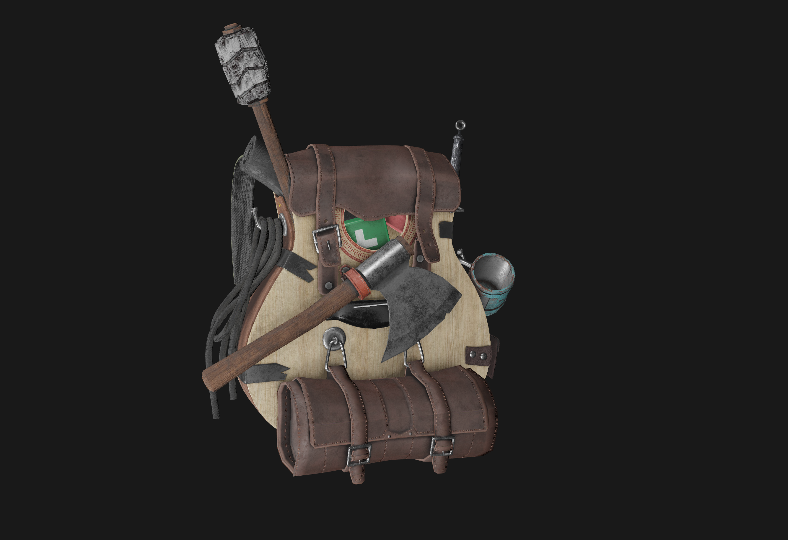

# Scop

3D obj model viewer

### Screenshot

### Controls

**WASD** - Camera movement 
**Space** - Move up 
**Left Shift** - Move down 
**Mouse Wheel** - Zoom 
**1** - Disable mouse capture 
**2** - Enable mouse capture 
**Q** - Switch render mode (Triangles, Pony, PBR) 
**R,T** - Move model on X axis 
**F,G** - Move model on Y axis 
**V,B** - Move model on Z axis
